# Restoran Yönetim Sistemi - N-Tier Architecture ve SignalR

**Restoran Yönetim Sistemi**, **ASP.NET Core 8.0** kullanılarak geliştirilmiş gerçek zamanlı bir sipariş yönetim sistemidir. Bu proje, **N-Tier Architecture** kullanarak modüler ve ölçeklenebilir bir yapı sunarken, **SignalR** ile anlık bildirimler, mesajlaşma ve gerçek zamanlı istatistikler sağlamaktadır.

Bu sistem, restoran işletmelerinin sipariş süreçlerini verimli bir şekilde yönetmelerini kolaylaştırırken, kullanıcı deneyimini artırmak için anlık güncellemeler sunmaktadır.

## 📌 Ana Özellikler
- **N-Tier Architecture**: Katmanlı mimari ile esnek ve sürdürülebilir bir yapı.
- **SignalR**: Gerçek zamanlı bildirimler, mesajlaşma ve canlı sepet güncellemeleri.
- **Gerçek Zamanlı Sipariş Yönetimi**: Kullanıcılar siparişlerini canlı olarak takip edebilir.
- **Admin Paneli**: Sipariş ve rezervasyonların merkezi bir noktadan yönetimi.
- **Mail Bildirimleri**: Kullanıcıların rezervasyon ve sipariş durumları hakkında bilgilendirilmesi.

## 📂 Proje Yapısı

```bash
SignalRProject
├── SignalRProject.Busnias  
├── SignalRProject.DataAccessLayer       
├── SignalRProject.EntityLayer 
├── SignalRProject.API          
├── SignalRProject.WebUI        
```

## 📡 SignalR Kullanımı
Bu projede **SignalR** aşağıdaki işlevlerde kullanılmıştır:
- **Masa Doluluk Kontrolü.**
- **Anlık Bildirimler**: Kullanıcılara sipariş ve rezervasyon durumları hakkında anlık bilgilendirme yapılır.
- **Gerçek Zamanlı Sepet İşlemleri**: Kullanıcıların sipariş sepeti anlık olarak güncellenir.
- **Mesajlaşma Özellikleri**: Kullanıcılar ve yönetim arasında gerçek zamanlı mesajlaşma.

## 🖼️ Proje Görselleri
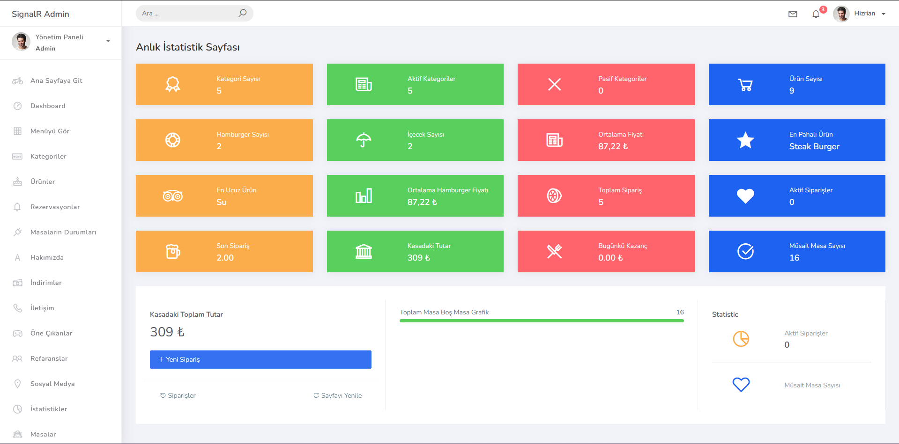
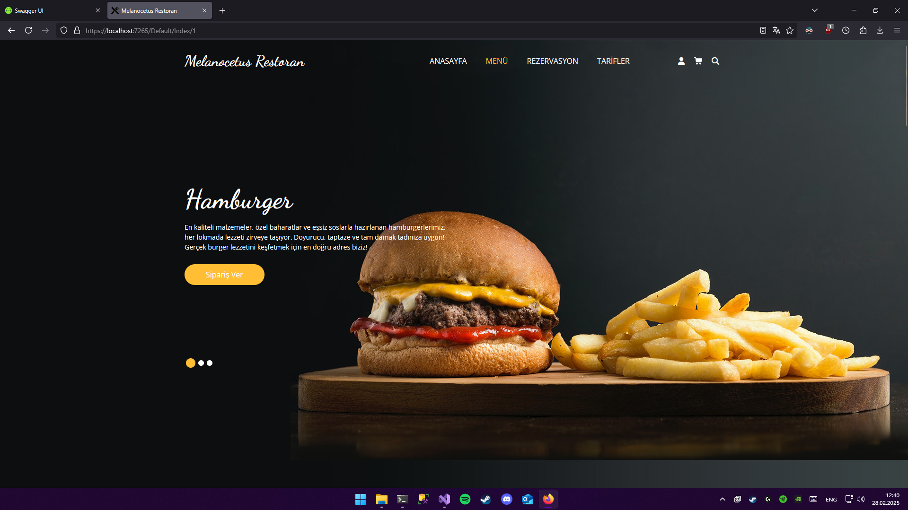
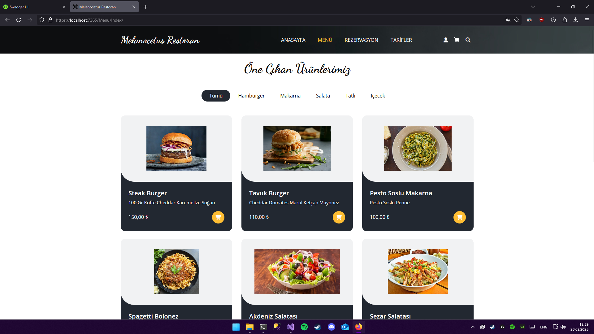
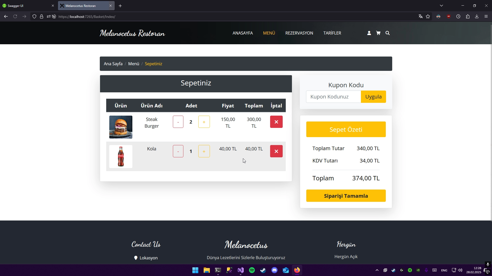
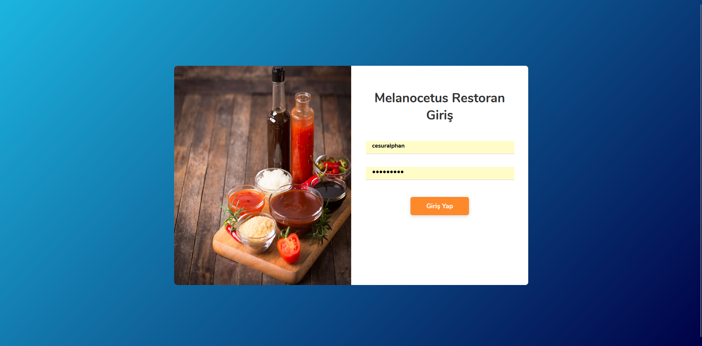
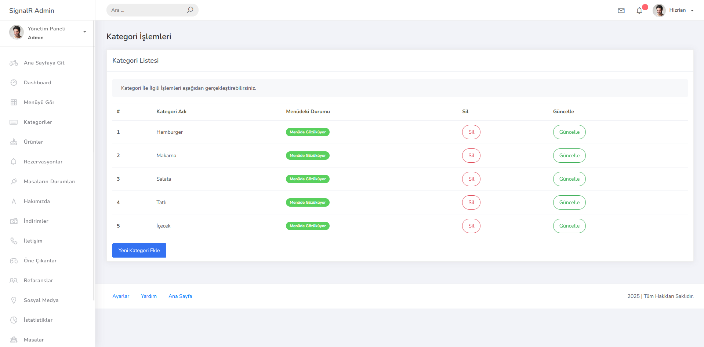
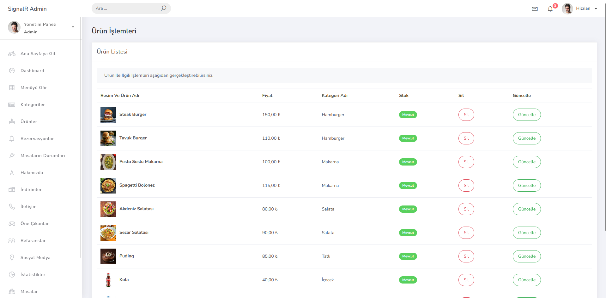
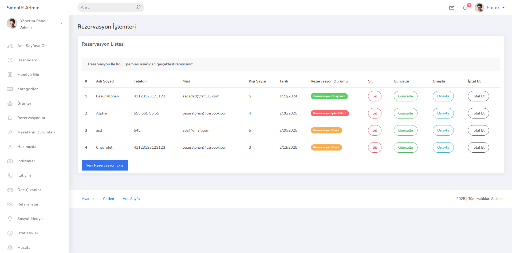
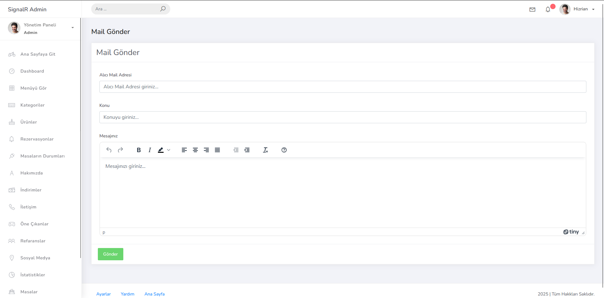
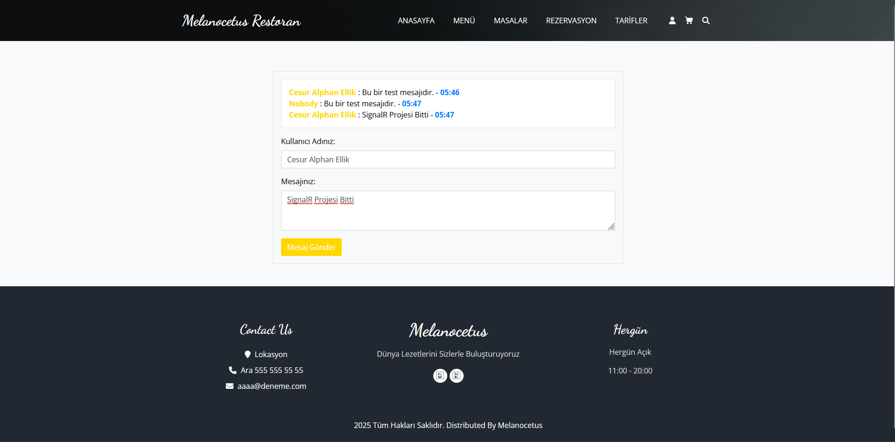
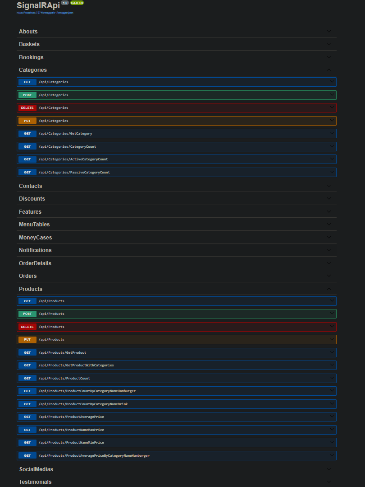
